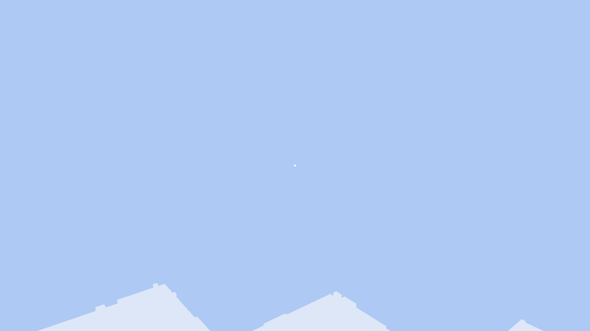
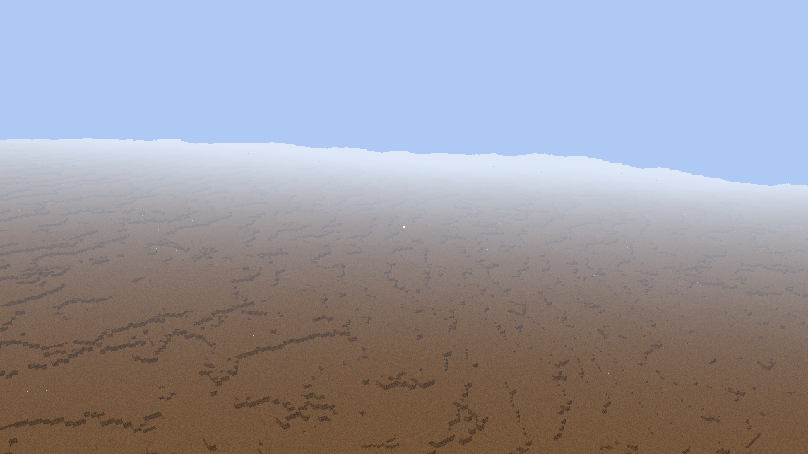

# 0042 — A horizon you can dial

The user's report was one sentence: *the cutoff is still too near, can't see
macro shape of landscape.*

It is worth sitting with how bad that is. We had just spent journal/0036 on
tectonic history, journal/0039 on the plumbing to switch it on, and
journal/0040 on a walk whose entire purpose was to look at what the amplitude
knob did to the shape of the land — and the walk could not answer, because the
world ends 1.2 km away. A mountain range in this worldgen is 5 to 20 km across.
At a 1.2 km horizon the camera is always *inside* the landform. You are never
looking at a mountain; you are standing on part of one, seeing a slope. The
macro shape we spent three milestones simulating had never once been in frame.

Here is the same pose in the same world — 2400 m up, pitched 14° down, over a
`--extent large` world — before and after. The before frame is not a bad
screenshot; that is the whole game at that vantage.




The number was a `const`:

```rust
pub const FAR_MAX_M: f64 = 1200.0;
pub const RING_EDGES_M: [f64; 5] = [FULL_DETAIL_RADIUS_M - FAR_OVERLAP_M, 256.0, 512.0, 1024.0, FAR_MAX_M];
```

To see a 10 km vista you had to edit that line and recompile — which, as
journal/0039 put it about the deep-time flags, is not a walk, it is a fork.

## The distribution rule was hiding in the literals

The obvious refactor — hoist the array into a `Resource` — needs an answer to
"what are the OTHER four numbers when the horizon is 8 km?" The shipped array is
five literals with no stated rule, so the first job was reading the rule back
out of them. It is there: `FULL_DETAIL_RADIUS_M` is 128, and 256 / 512 / 1024
are exactly 2× / 4× / 8× of it. The interior edges are a doubling ladder
anchored at the full-detail radius; only the last entry is the horizon.

That is not a coincidence of taste. Tiles double in size with each LOD level
(57.6 m at L1 up to 460.8 m at L4), so a ring whose radius also doubles holds
roughly the same number of tiles as the one inside it — which is exactly what
journal/0023 measured: 188 tiles spread 56 / 56 / 56 / 20 across L1..L4.

## The wrong stretch, and why we didn't ship it

The tempting generalization is to scale all four edges with the horizon, so an
8 km field is the 1.2 km field enlarged. It reproduces the default exactly and
it looks principled. It is also a disaster, and the arithmetic says so before
any code runs. At a 10 km horizon the L1 ring would stretch from 112 m to
2133 m while its tiles stayed 57.6 m across: about 4,300 level-1 tiles, where
today there are 56. Every one of them carrying 1.8 m voxel detail that, two
kilometres out, is a fraction of a pixel. The per-frame *want-set scan* would
have suffered too — `wanted_far_tiles` sweeps a square of radius `outer/tile_m`
per level, so the L1 scan would have gone from 11×11 to 349×349 cells, every
frame, to reject almost all of them.

So the shipped rule stretches the **outermost ring only**. The interior ladder
stays where it is — 112 / 256 / 512 / 1024 — and `--horizon` moves the fifth
edge. Everything past 1024 m is L4: 460.8 m tiles of 14.4 m coarse voxels, the
coarsest and cheapest-per-square-kilometre geometry the four-level scheme has,
which is precisely the right thing to spend on ground that is kilometres away.
It also means the fine rings' cost is *provably* unchanged by the knob, which
is a nice property to have when the whole slice is "don't break what works."

## Proving the default is invisible

Same discipline as journal/0039: the load-bearing test is not "the flag works,"
it is "the flag off changes nothing."

```rust
assert_eq!(hz.ring_edges, [112.0, 256.0, 512.0, 1024.0, 1200.0]);
assert_eq!(hz.near_cover_r_m(), 112.0);
assert_eq!(hz.camera_far_m(), 3000.0);
assert_eq!(hz.fog_range_m(), (150.0, 1100.0));
```

Those are the four shipped constants, restated as literals, checked against the
derived config. The derivation is arranged so the default lands on them by
exact float equality, not within a tolerance — `2.0 * 128.0` is 256.0, and the
fog/far-plane scalings multiply by `far_max / 1200.0`, which is exactly 1.0 on
the default path.

## Two things that had to travel with the horizon

Neither was in the brief, and both would have silently defeated the feature.

**The camera far plane** was a hard 3000.0 — 2.5× the far field, headroom for
the outermost ring's corners. At `--horizon 8` the far plane would have sliced
the field off at 3 km, and the extra rings would have been built, meshed,
uploaded, and then clipped. It now rides the same 2.5× ratio.

**Distance fog** was worse, because it fails *quietly*. The lit pass hazes from
150 m to full white at 1100 m — tuned, obviously, against a 1.2 km field. A
10 km horizon under that fog is 10 km of geometry behind an opaque wall of
haze at 1.1 km. You would have paid 172 MiB and 14 seconds of streaming to
render a white screen, and the honest conclusion from the screenshot would have
been "the flag doesn't work." This is the journal/0030 failure mode exactly:
an instrument that cannot see the question, reporting a null. Fog start/end now
scale with the horizon.

## The measurements

Because the horizon is now a runtime value, journal/0023's *projection* of the
5–10 km field could be replaced by building the whole field at each setting and
measuring it. Worst case — viewer at 5 km altitude, so no column is
coverage-culled and every wanted tile emits its full stepped geometry:

| horizon | tiles (L1..L4) | triangles | mesh MiB | ms/tile | frame ms (2-tile budget) | full fill @60fps | coarsest step |
|---|---|---|---|---|---|---|---|
| 1.2 km (default) | 188 [56, 56, 56, 20] | 126,146 | 20.7 | 1.86 | 3.72 | 1.6 s | 14.4 m |
| 3 km | 288 [56, 56, 56, 120] | 188,960 | 31.0 | 1.64 | 3.27 | 2.4 s | 14.4 m |
| 5 km | 540 [56, 56, 56, 372] | 348,300 | 57.1 | 2.01 | 4.02 | 4.5 s | 14.4 m |
| 10 km | 1648 [56, 56, 56, 1480] | 1,050,916 | 172.4 | 3.05 | 6.10 | 13.7 s | 14.4 m |

The 1.2 km row reproduces journal/0023's 188 tiles / ~21.5 MiB, which is the
best evidence the refactor is behaviour-preserving that a table can give.

The shape of the cost is the interesting part. Tiles grow with the square of
the horizon (all of it in L4, as designed), so memory does too: 20.7 MiB →
172 MiB from 1.2 to 10 km. But the *per-frame* number barely moves, because the
budget is two tiles per frame no matter how many tiles are wanted. A wider
horizon does not buy you a hitch; it buys you more seconds of streaming — 1.6 s
at the default, 13.7 s at 10 km, the far field filling in from the near edge
outward while you stand there.

The coarsest voxel step stays 14.4 m at every setting, which is the payoff of
stretching L4 rather than adding rings. journal/0023's projection assumed extra
LOD levels; those would have put 28.8 / 57.6 / 115 m voxels on the far vista.
We reach 10 km with the same 14.4 m step we use at 1.1 km — legibility is
*better* than the projection, and memory is worse (172 MiB vs the projected
43 MiB) for exactly the same reason. That is the tradeoff this slice makes, and
it is the right one at 10 km and the wrong one at 50: cost is quadratic and
detail is wasted, so the honest ceiling on the current 4-level scheme is around
10 km. Past that the answer is more LOD levels, not a longer L4.

The live run agrees with the table qualitatively: at `--horizon 8` the field
streamed in from the near edge outward over roughly ten seconds with no
observable hitch or stall, which is what a fixed per-frame budget is supposed to
buy. It also shows the residual haze problem — even with the fog scaled, the
outer third of an 8 km vista is washed toward white, so silhouette reading works
out to maybe 5–6 km. Whether the haze curve wants its own knob is a separate
(and user-owned) visual call; this slice deliberately only kept the existing
curve proportional.

One measured wrinkle: ms/tile drifts up with the horizon (1.86 → 3.05) even
though the tiles are identical in size. It is not the mesher — it is the
worldgen summary sampler taking more cache misses when consecutive tiles are
460 m apart across a 10 km span. It shows up as the 2-tile frame cost going
3.7 ms → 6.1 ms, which is real but still a budgeted, non-hitching cost.

## What did not change

The FF2a/0024 properties are all structural, and the refactor was careful to
touch none of them: the columns are still FLOOR-quantized to the level's coarse
step (stepped voxel language, not a TIN); side faces are still emitted once by
the taller column; `near_covers` still culls under the near field rather than
burying a sheet; the anti-z-fight push is still one shared camera-forward vector
per level per frame (`level_depth_push` takes no tile coordinate and no ring
extent — the horizon literally cannot reach it); one shared material, so
multidraw batching is untouched. The sky-hole coverage theorem from
journal/0022 walk 17 got a second test at a 10 km horizon, sweeping 112 m to
8 km at 2 m radial × 0.5° resolution: zero uncovered ground points.

> blogworthy: the constant that had a rule inside it. Five literals in an array
> encoded a doubling ladder nobody had written down, and the entire question of
> "what does this knob do" was really "which of these numbers is the free one."
> Reading the rule back out of shipped constants — and then *deliberately not*
> generalizing along the axis that looked most symmetric — is most of what this
> kind of refactor is.

## Using it

```
cargo run --release -p dc-client -- --horizon 8
```

Kilometres, float, 0.2 to 64. A bad value warns and boots the default rather
than aborting (the `--amplitude` behaviour from journal/0039). Omit it and the
game is byte-identical to before this entry. Note that `--edges` fades its
outlines to zero past 1.4 km by design (journal/0031), so at a wide horizon the
far field carries no edge signal — judge those silhouettes by the skyline, and
judge shape in the lit pass, which is what the horizon exists to make possible.

The legacy S1 far mesh (keys 3/4) deliberately does *not* follow the knob. It is
a volumetric 3-D shell, so its wanted-set is a cube of chunk positions: its cost
grows with the cube of the horizon, not the square. It is also the
phantom-old-world path of journal/0017. The knob belongs to the real horizon.
